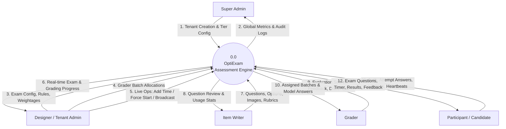
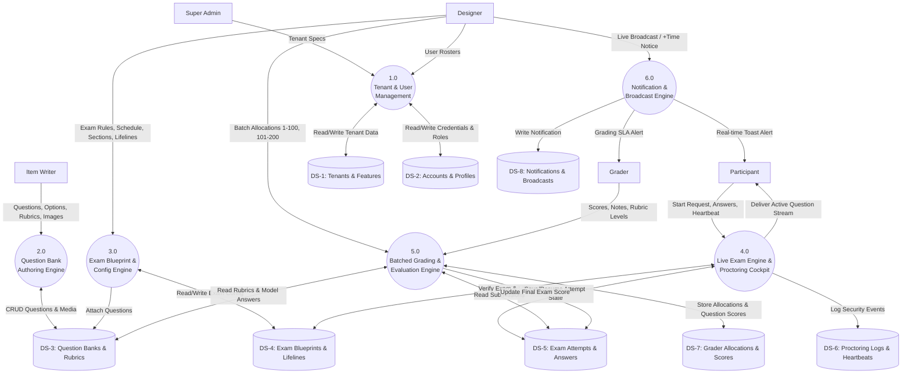
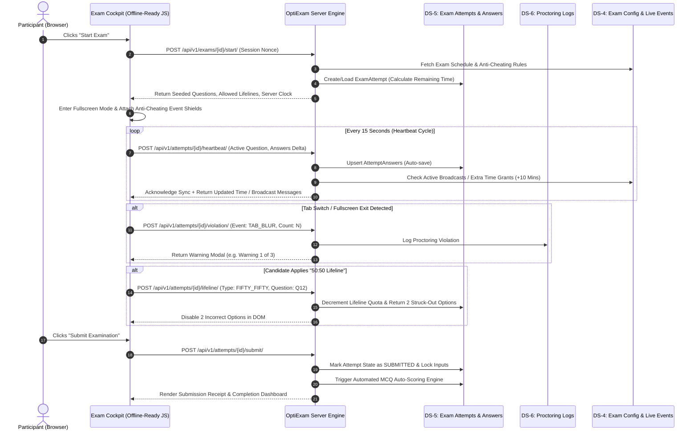
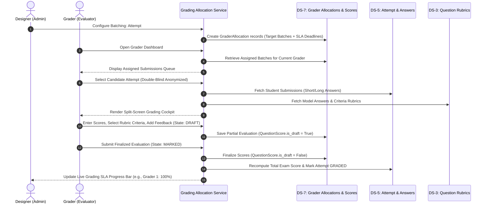
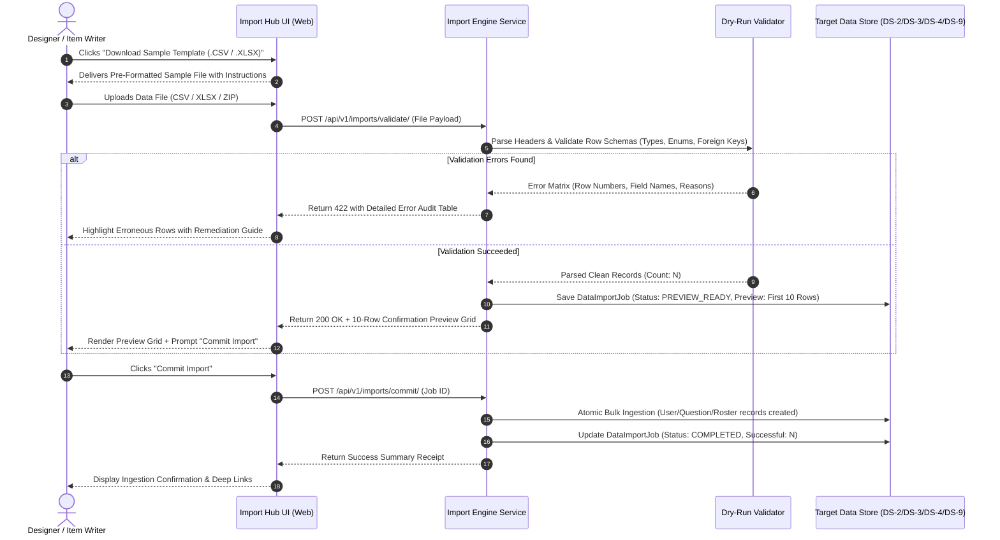

# Data Flow Diagrams (DFD) — OptiExam System
**Document Version:** 1.0.0  
**Project:** OptiExam Assessment Platform  
**Target Format:** Structured Markdown with Visual Mermaid Diagrams & Data Dictionaries  

---

## 1. DFD Level 0: Context Diagram

The Level 0 Context Diagram establishes the boundary of the OptiExam system and its interactions with the **5 External Entities**.

---

## 2. DFD Level 1: Subsystem Decomposition

The Level 1 Diagram decomposes OptiExam into 6 core subsystems and 8 persistent data stores.

---

## 3. DFD Level 2: Detailed Process Workflows

### 3.1 Process 4.0: Live Examination & Anti-Cheating Data Flow

---

### 3.2 Process 5.0: Distributed Batched Grading & Evaluation Data Flow

### 3.3 Process 7.0: Bulk Data Ingestion, Dry-Run Validation & Commit Flow

---

## 4. Comprehensive Data Store & Flow Dictionary

| Data Flow ID | Flow Name | Source | Destination | Data Attributes / Payload Fields |
|---|---|---|---|---|
| **DF-01** | Tenant Registration | Super Admin | DS-1 | `name`, `slug`, `domain`, `tier`, `max_concurrent_users`, `feature_flags` |
| **DF-02** | Exam Blueprint Config | Designer | DS-4 | `title`, `code`, `start_time`, `end_time`, `duration_mins`, `pass_mark`, `lifeline_rules`, `anti_cheat_rules` |
| **DF-03** | Question Creation | Item Writer | DS-3 | `type` (MCQ, Image, Short, Long), `prompt_text`, `options_json`, `image_asset`, `model_answer`, `rubric_schema` |
| **DF-04** | Heartbeat & Auto-Save | Participant UI | DS-5 | `attempt_id`, `question_id`, `selected_options`, `text_answer`, `time_remaining_client`, `client_timestamp` |
| **DF-05** | Proctoring Incident | Participant UI | DS-6 | `attempt_id`, `violation_type` (`BLUR`, `FULLSCREEN_EXIT`, `KEY_LOCK`), `snapshot_ts`, `incident_count` |
| **DF-06** | Live Time Extension | Designer | DS-4 / DS-8 | `exam_id`, `target_type` (`ALL` or `SINGLE_USER`), `extra_minutes`, `reason`, `issued_at` |
| **DF-07** | Grader Allocation | Designer | DS-7 | `exam_id`, `grader_id`, `candidate_range_start`, `candidate_range_end`, `sla_deadline` |
| **DF-08** | Question Evaluation | Grader | DS-7 | `attempt_id`, `question_id`, `awarded_marks`, `rubric_criteria_selected`, `grader_notes`, `is_draft` |
| **DF-09** | System Notification | Notification Svc | DS-8 | `tenant_id`, `recipient_id`, `title`, `body`, `action_url`, `is_read`, `priority` |
| **DF-10** | Bulk Data Import | Designer / Item Writer | DS-9 / DS-2/3/4 | `import_type`, `source_file`, `status`, `total_rows`, `preview_data`, `error_log`, `target_id` |

---

## 5. Failure & Edge Case Data Flows

### 5.1 Network Dropout During Sync
* If client fails to reach server on heartbeat:
  1. Offline JS Engine writes payload to browser `localStorage` under `optiexam_offline_queue`.
  2. Cockpit displays non-blocking amber badge: *"Offline Mode: Answers safely stored locally"*.
  3. Exponential backoff retry occurs at 3s, 6s, 12s.
  4. On connection recovery, queued answers are flushed in a single bulk sync transaction.

### 5.2 Concurrent Examiner Score Updates
* `QuestionScore` records utilize optimistic concurrency locking with `version` fields to prevent two graders from overwriting the same candidate's essay score simultaneously.

### 5.3 Malformed or Corrupt Bulk Import Files
* If uploaded CSV/Excel contains malformed rows, missing mandatory headers, or invalid foreign keys:
  1. Dry-run parser rejects ingestion before any database writes occur.
  2. Generates line-by-line `error_log` JSON with column names and error messages.
  3. UI renders an interactive error table with 1-click "Download Error Report" so the user can fix erroneous cells in Excel and re-upload.

