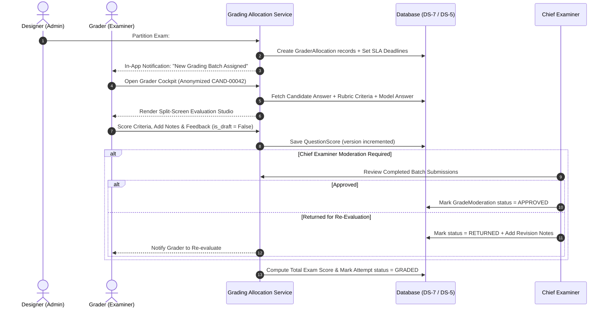

# Phase 4: Distributed Batched Grading, Evaluation & Moderation
**Document:** `Doc/phase_04_batched_grading_and_evaluation.md`  
**Project:** OptiExam Assessment Platform  
**Target Environment:** Python 3.12+ / Django 5.x / `C:\venv\envoptiexam`  
**Document Version:** 1.0.0  
**Phase Status:** Ready for Implementation (Depends on Phases 1, 2, & 3)  

---

## 1. Phase Overview & Strategic Objectives

Phase 4 delivers the post-exam assessment and grading engine of OptiExam. It automates MCQ scoring instantaneously upon submission and enables the Designer to distribute subjective short/long questions across multiple Graders using the **Batched Allocation Matrix** (e.g. Candidates 1–100 → Grader A; 101–200 → Grader B). Graders evaluate responses in a **Double-Blind Split-Screen Cockpit** using step-by-step rubrics and model answers, supported by optimistic concurrency locking and a **Chief Examiner Moderation Workflow**.

```
┌────────────────────────────────────────────────────────────────────────┐
│                          PHASE 4 DELIVERABLES                          │
├────────────────────────────────────────────────────────────────────────┤
│  1. Instant Automated MCQ Scoring Engine (Positive/Negative Marks)     │
│  2. Grader Allocation Matrix Hub (Batch Partitioning & SLA Deadlines)  │
│  3. Grader Dashboard with Queue Metrics & SLA Countdown Trackers       │
│  4. Double-Blind Split-Screen Evaluation Cockpit UI (`grading.css`)    │
│  5. Rubric-Based Scoring Matrix with Dynamic Mark Summation            │
│  6. Draft vs Finalized Evaluation State Machine with Version Locking   │
│  7. Chief Examiner / Designer Grade Moderation Engine                  │
│  8. Automated Aggregate Exam Mark & Pass/Fail Computation Service      │
│  9. In-App SLA Reminder Notification Engine for Graders                │
│  10. Concurrency & Integrity Test Suite for Batched Evaluations        │
└────────────────────────────────────────────────────────────────────────┘
```

---

## 2. Target Component & Directory Layout

```
apps/
└── grading/
    ├── models.py              # GraderAllocation, QuestionScore, GradeModeration
    ├── admin.py
    ├── forms.py               # GraderAllocationForm, QuestionScoreForm, ModerationForm
    ├── urls.py                # app_name = 'grading'
    ├── views/
    │   ├── allocation_views.py # Designer batch assignment & SLA monitoring
    │   ├── evaluation_views.py # Grader queue & split-screen evaluation cockpit
    │   ├── moderation_views.py # Chief Examiner grade review & sign-off
    │   └── api_views.py       # Async score save & draft auto-sync
    ├── services/
    │   ├── scoring_service.py # auto_grade_mcq_submissions, compute_attempt_totals
    │   ├── allocation_service.py # create_batch_allocations, reassign_batch
    │   ├── grading_service.py # save_question_score, finalize_evaluation
    │   └── moderation_service.py # approve_moderation, return_for_reevaluation
    ├── selectors/
    │   └── grader_selectors.py # get_assigned_attempts_for_grader, get_grading_progress
    ├── templates/grading/
    │   ├── allocation_list.html # Designer matrix & progress bars
    │   ├── allocation_form.html # Create batch assignment modal/form
    │   ├── grader_dashboard.html # Grader batch queue & SLA timers
    │   ├── grading_cockpit.html # Split-screen evaluation studio
    │   └── moderation_hub.html  # Chief Examiner sign-off interface
    └── tests/
static/
├── css/
│   └── grading.css            # Split-screen studio, rubric sliders, diff panes
└── js/
    └── grader-cockpit.js      # Rubric point calculators, auto-summation, draft sync
```

---

## 3. Step-by-Step Implementation Tasks

### Task 4.1: Automated MCQ Scoring Engine (`apps/grading/services/scoring_service.py`)
1. Implement `auto_grade_mcq_attempt(attempt)`:
   * Runs immediately when an `ExamAttempt` transitions to `SUBMITTED` or `AUTO_SUBMITTED`.
   * For each `AttemptAnswer` linked to a `MCQ_SINGLE`, `MCQ_MULTIPLE`, or `IMAGE_MCQ`:
     * If `is_skipped == True`: awarded marks = `0.00`.
     * If single choice: checks if `selected_options.first() == correct_option`. If correct: awards `question.points`. If incorrect: deducts `question.negative_points`.
     * If multiple choice: evaluates all selected vs correct options. Applies partial credit if configured.
     * Sets `AttemptAnswer.is_auto_graded = True` and `AttemptAnswer.awarded_marks`.
   * Fast, bulk-executed within `@transaction.atomic`.

### Task 4.2: Grader Allocation Matrix Hub (`apps/grading`)
1. Implement `GraderAllocation` model with `candidate_range_start`, `candidate_range_end`, `section_scope`, `deadline`, and status (`PENDING`, `IN_PROGRESS`, `COMPLETED`).
2. Build `allocation_service.py` with `create_batch_allocations(exam, allocations_data)`:
   * Validates non-overlapping candidate ranges (e.g. 1–100, 101–200).
   * Validates all selected graders belong to the active tenant and hold role `GRADER`.
   * Creates `GraderAllocation` records and dispatches in-app `GRADING_ASSIGNED` notifications.
3. Build Designer Allocation Matrix Dashboard (`allocation_list.html`):
   * Visual progress bars for each grader (e.g. Grader 1: 95% complete; Grader 2: 40% complete).
   * SLA deadline countdown indicator (Green = on track, Amber = < 12h remaining, Red = overdue).
   * "Send SLA Reminder" button triggering `dispatch_grading_reminder()`.

### Task 4.3: Grader Dashboard & Queue Management
1. Build `GraderDashboardView` at `/{tenant_slug}/grading/`:
   * Displays active batches assigned to the logged-in grader.
   * Total candidates assigned, marked count, draft count, pending count.
   * SLA deadline badge and estimated time to completion.
2. Clicking a batch launches the candidate list (ordered by sequential `candidate_index`).

### Task 4.4: Split-Screen Evaluation Cockpit UI (`grading_cockpit.html`)
1. Implement `Double-Blind Evaluation Mode`:
   * Masks candidate real name, registration #, and avatar.
   * Displays anonymized candidate tag: `CAND-{attempt.id:05d}`.
2. Build Two-Pane Split-Screen Layout (`static/css/grading.css`):
   * **Left Pane (Candidate Submission)**:
     * Question prompt + high-res diagram.
     * Candidate's submitted text answer / essay response.
     * Word count badge vs allowed word limit.
   * **Right Pane (Model Answer & Rubric Matrix)**:
     * Accordion containing Item Writer's rich **Model Answer / Sample Solution**.
     * **QuestionRubric Scoring Matrix**:
       * Criteria cards (e.g. "Theoretical Accuracy [Max 5]", "Working Steps [Max 5]").
       * Scoring slider / numeric inputs per criterion.
       * Dynamic JavaScript auto-summation calculating total awarded marks in real time.
     * **Examiner Notes (Private)**: Confidential notes for moderation.
     * **Feedback to Student**: Constructive feedback visible to student after result release.
     * **State Controls**: "Save as Draft" vs "Finalize & Mark Complete".

### Task 4.5: Optimistic Concurrency Locking & Draft Sync
1. Implement `save_question_score(answer, grader, marks, rubric_data, notes, feedback, is_draft, client_version)` in `grading_service.py`:
   * Checks `QuestionScore.version == client_version`.
   * If version mismatch occurs (another examiner modified record), returns `409 Conflict` to prevent overwriting.
   * Increments `version += 1` on successful save.
   * Saves partial evaluation when `is_draft = True`.
   * Locks evaluation when `is_draft = False` (`MARKED`).

### Task 4.6: Chief Examiner / Designer Grade Moderation
1. Implement `GradeModeration` model (`PENDING`, `APPROVED`, `RETURNED`).
2. Build Chief Examiner Review Hub (`moderation_hub.html`):
   * View all finalized student scores with grader notes and rubric breakdown.
   * Actions:
     * **Approve Grade**: Sets `GradeModeration.status = APPROVED`.
     * **Return for Re-Evaluation**: Sets `status = RETURNED` with mandatory revision comments. Unlocks `QuestionScore.is_draft = True` and notifies grader.

### Task 4.7: Final Exam Score Aggregation Engine
1. Implement `finalize_attempt_grade(attempt)` in `scoring_service.py`:
   * Sums all `AttemptAnswer.awarded_marks` across all questions in the exam.
   * Sets `ExamAttempt.total_score = sum(awarded_marks)`.
   * Evaluates passing criteria:
     $$\text{is\_passed} = \left( \frac{\text{total\_score}}{\text{exam.total\_marks}} \times 100 \right) \ge \text{exam.passing\_percentage}$$
   * Sets `ExamAttempt.status = GRADED`.

---

## 4. Batched Grading Workflow Sequence Diagram



---

### 4.1 UI/UX Split-Screen Evaluation Studio (Full Screen Width)
1. **100% Full-Width Split-Screen Studio**:
   * Uses 100% full screen width layout (`width: 100%; max-width: 100%;`).
   * **Left Panel (50% Full-Width):** Candidate Subjective Answer text, formatted code blocks, or diagram image attachments with inline zoom.
   * **Right Panel (50% Full-Width):** Model Answer, Rubric Criteria Matrix (1-click point selectors), and Grader Feedback textarea.
2. **Double-Blind Candidate Strip**:
   * Top bar spans full screen width showing anonymized index (e.g. `Candidate #042`), question navigation tabs, and grading progress bar.

---


## 5. Verification & Automated Test Plan

### Test Suite Execution
```powershell
& "C:\venv\envoptiexam\Scripts\python.exe" -m pytest apps/grading/tests -v --cov=apps/grading
```

### Key Test Cases:
1. `test_mcq_auto_scoring_accuracy`: Validates positive and negative marks are calculated accurately on attempt submission.
2. `test_batch_allocation_non_overlapping`: Validates system prevents assigning overlapping candidate ranges (e.g. 1–50 and 40–100) to different graders.
3. `test_double_blind_candidate_masking`: Verifies grader views do not leak candidate personal names or registration numbers.
4. `test_optimistic_locking_prevents_overwrite`: Simulates two concurrent score submissions with identical version and validates second request receives `409 Conflict`.
5. `test_rubric_summation_validation`: Verifies awarded marks cannot exceed total question maximum marks.
6. `test_total_score_and_pass_fail_computation`: Validates accurate percentage calculation and `is_passed` boolean assignment.
7. `test_moderation_return_unlocks_score`: Validates returning an evaluation unlocks `is_draft` state for grader re-editing.

---

## 6. Definition of Done (DoD) for Phase 4
* [ ] MCQs are auto-scored instantaneously upon exam submission.
* [ ] Designers can partition candidates into batches (e.g. 1–100, 101–200) and assign graders with SLA deadlines.
* [ ] Graders can evaluate subjective questions in a double-blind split-screen cockpit with rubrics and model answers.
* [ ] Concurrency locking prevents grade overwrites; draft/final states function properly.
* [ ] Chief Examiner moderation workflow approves or returns evaluations.
* [ ] Final total score and pass/fail status are calculated accurately.
* [ ] All tests pass with ≥ 90% code coverage.
